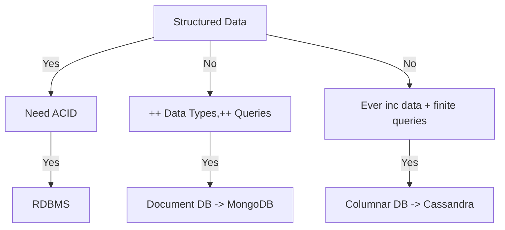

# System Design Interviews

# Step by Step Guide:

## 1: Requirements clarifications
### Functional Requirements
Ask questions about scope 
	- Clarify which parts of system we will be focusing on
	- Don't just assume whatever the interviewer said is all you need to know
#### Example Q's:
- Should we handle **user auth**, **security**, or **session management**?
- Do we need to consider **logging/metrics**?

## 2: Back of envelope estimation
Things to calculate:

- Network bandwidth
- Storage space
- IO Throughput


### Non-functional Requirements
Estimate scale of the system. 
#### Example Q's:
- What **scale** is expected from the system (# of new tweets, # of tweet views, # of timeline generations, etc)
- How much **storage** will we need? 
	- object store like Amazon S3?
- What network **bandwidth** usage are we expecting?
- Should we expected **uniform** traffic or **spiky**?
- Is it **write** or **read** heavy?
	- read heavy - leverage duplicating nodes (** data replication**)
	- write heavy - split up data across different **shards**

## 3: System interface definition
Time to define API's expected from system. List down each endpoint that you might need
#### Example:
```
postTweet(user_id, tweet_data, tweet_location, user_location, timestamp)
generateTimeline(user_id, current_time, user_location)
markFavorite(user_id, tweet_id)
```

## 4: Defining data model
Write out your entities/their relationship to one another
#### Example entities:
```
User: UserID, Name, Email, DoB, CreationDate
Tweet: TweetId, Conent, Location, NumLikes, Timestamp
UserFollow: UserID1, UserID2
FavoriteTweets: UserID, TweetID, Timestamp, Active
```
Consider what **database system** we should use?
- How much data will be stored?
- How quickly will it be growing?
- Will the types of queries change over time?

[Database Design Tips](https://www.youtube.com/watch?v=cODCpXtPHbQ&ab_channel=codeKarle)


- Choice of DB depends on a few factors:
	- Structure of data
	- Query pattern we have
	- Amount of scale we need
- **Caching**
	- Key-value
	- Ex: *Redis*, *Memcached*
- **Object storage**
	- Blob storage - *Amazon S3*
	- **CDN** - *content delivery network*
		- static object caching - have copies of objects across the globe so they are physically closer to clients
- **Text-searching capabilities**
	- Search on both title and contents of description, fields, etc
	- *Elastic-search*, *Solr* - Both search engines, **not** databases. 
		- DB's guarantee data won't be lost. Search engines dont - high availability/consistency tho. Don't use as source of truth.
	- Fuzzy-search - able to understand typo's, similar words, etc.
		- Use edit distance
- **Time-series DB**
	- *InfluxDB*
- **Big Data** - want to do analytics on data
	- *Hadoop*
	- Not for querying

SQL: Guarantees **ACID** compliance
- Atomicity: the “all or nothing” rule — the transaction either happens completely or doesn’t happen at all
- Consistency: data is consistent before and after a transaction without any missing steps
- Isolation: multiple transactions can happen concurrently without reading the wrong data
- Durability: transactional success is robust to system failure

NoSQL: **key-value**, **document**, **graph**
Ex: Cassandra, MongoDB, etc

## 5: High-level design
Draw a block diagram representing core components of system. 

## 6: Detailed Design
Let interviewer guide which components to dig deeper into. 

- Consider **tradeoffs**
#### Example questions:
- Since we will be storing massive amounts of data, how should we partition our data to distribute it to multiple databases? Should we try to store all the data of a user on the same db? What issues could it cause?
- How will we handle hot users who tweet a lot or follow lots of people?
- Since users' timelines will contain the most recent tweets, should we try to store our data so that it is optimized for scanning latest tweets?
- How much and at which layer should we introduce cache to speed things up?
- What components need better load balancing?

## 7: Identifying and resolving bottlenecks
Try to discuss as many bottlenecks as possible and different approaches to mitigate them

- Is there are single **point of failure** in our system? What are we doing to mitigate it?
- Do we have **enough replicas** of the data so that we can still serve our users if we lose a few servers?
- Do we have **enough copies** of different services running s.t. a few failures will not cause a total system shutdown?
- How are we **monitoring** performance of our system? (Observability/alerting)

# Topics

## CAP Theorem
Also called **Brewer's theorem** - it is **impossible** to simultaneously provide more than two of the three guarantees:
1. **Consistency**: Every read received the most recent write or an error
2. ** Availability**: Every request receives a (non-error) response, w/o guarantee that it contains the most recent write
3. **Partition tolerance**: The system continues to operate despite an arbitrary num. of messages being dropped (or delayed) by the network between nodes

# Sample Mock Interviews
## Reddit Homepage Feed
